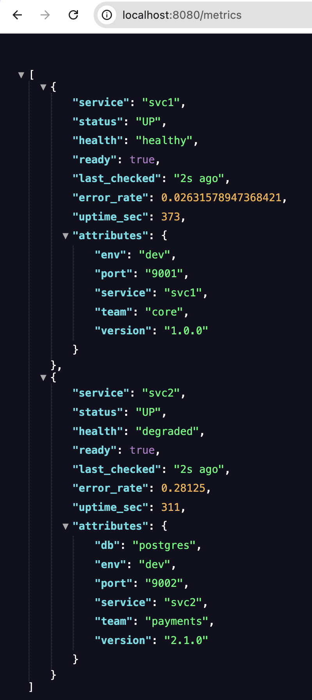

# System Health Monitor (Go)

A polling-based service health monitor written in Go.
This project demonstrates **dynamic service registration**, **bounded-concurrency polling**, **per-service polling intervals**, **readiness vs health evaluation**, and **graceful shutdown** using `context`.

---

## Overview

The monitor periodically polls registered services over HTTP and evaluates their state based on reachability, readiness, and error metrics.

Services **self-register at runtime**; there is no static configuration file and no heartbeat mechanism. All health information is obtained strictly via polling.

Key characteristics:

* Polling-based monitoring (no push / heartbeat)
* Dynamic service registration via HTTP
* Per-service polling intervals
* Snapshot-based polling cycles (no overlap)
* Bounded worker pool (maximum 5 concurrent polls)
* Clear separation of readiness vs health
* Graceful shutdown via context cancellation

---

## Project Structure

```
system-health-monitor/
├── go.mod
├── monitor/
│   ├── main.go
│   └── internal/
│       ├── models.go      # Core data models
│       ├── store.go       # Thread-safe in-memory store
│       ├── monitor.go    # Polling scheduler + worker pool
│       └── handlers.go   # HTTP handlers
└── services/
    ├── svc1/
    │   └── main.go        # Example mostly-healthy service
    └── svc2/
        └── main.go        # Example error-prone service
```

---

## Service Registration

Services register themselves dynamically using:

```
POST /register
```

Example payload:

```json
{
  "id": "svc1",
  "url": "http://localhost:9001",
  "poll_interval_sec": 10,
  "attributes": {
    "env": "dev",
    "team": "core"
  }
}
```

### Registration Semantics

* `id` and `url` are mandatory
* `poll_interval_sec` is optional

  * If omitted or zero, the global default interval is used
* Attributes provided during registration are stored and later **merged** with attributes returned by `/health`

---

## Polling Model

The monitor runs a **self-timed scheduler loop** with a global pacing interval (default: 10 seconds).

Each iteration performs the following steps:

1. Take a snapshot of all registered services
2. Select only those services whose **per-service polling interval has elapsed**
3. Create a **per-cycle job queue** sized to the snapshot
4. Start a bounded worker pool (max 5 workers)
5. Poll each selected service **exactly once**
6. Update metrics atomically in the store

### Important Properties

* **No overlapping cycles**
* **No persistent queue**
* If a cycle takes longer than the pacing interval, the next cycle starts immediately
* Newly registered services are picked up automatically in the next cycle

This avoids stale checks and unbounded backlog accumulation.

---

## Health and Readiness Semantics

Readiness and health are treated as separate concerns.

### Readiness

* `ready = true` → HTTP 200 received from `/health`
* `ready = false` → network error or non-200 response

### Health Classification

| Condition                       | Health      |
| ------------------------------- | ----------- |
| Request failure / timeout       | `dead`      |
| HTTP non-200 response           | `unhealthy` |
| 200 OK + error rate > threshold | `degraded`  |
| 200 OK + error rate ≤ threshold | `healthy`   |

This model mirrors real-world systems such as Kubernetes readiness and liveness probes.

---

## Metrics Endpoint

```
GET /metrics
```

Returns JSON for **all registered services**, including:

* readiness (`ready`)
* health status
* uptime (seconds)
* request count
* error count
* error rate
* merged dynamic attributes
* last checked age (seconds)

This endpoint is read-only and never triggers polling.

Sample GET /metrics response:



---

## Example Services

Two example services are included to demonstrate behavior:

### svc1

* Mostly healthy
* Low error rate
* Poll interval: 10 seconds

### svc2

* Higher error rate
* Frequently enters `degraded` state
* Poll interval: 5 seconds

Each service:

* Exposes `/health`
* Maintains its own counters
* Registers itself with the monitor at startup

---

## Running the Project

Start the monitor:

```bash
go run monitor/main.go
```

Start the example services:

```bash
go run services/svc1/main.go
go run services/svc2/main.go
```

View aggregated metrics:

```
http://localhost:8080/metrics
```

---

## Design Rationale

* **Snapshot-based polling** avoids races with dynamic registration
* **Per-cycle queues** coordinate work without retaining stale jobs
* **Bounded concurrency** prevents overload
* **Self-timed scheduling** adapts naturally to slow or fast polling cycles
* **Context cancellation** ensures clean shutdown of goroutines

The architecture is intentionally minimal but reflects production monitoring patterns used by systems such as Prometheus and Kubernetes controllers.

---

## Possible Extensions

* Prometheus exporter
* Persistent storage (SQLite / BoltDB)
* gRPC health checks
* Alerting / notification hooks
* Jittered scheduling to avoid thundering herds

---

## License

This project is licensed under the MIT License.
See the [LICENSE](LICENSE) file for details.
